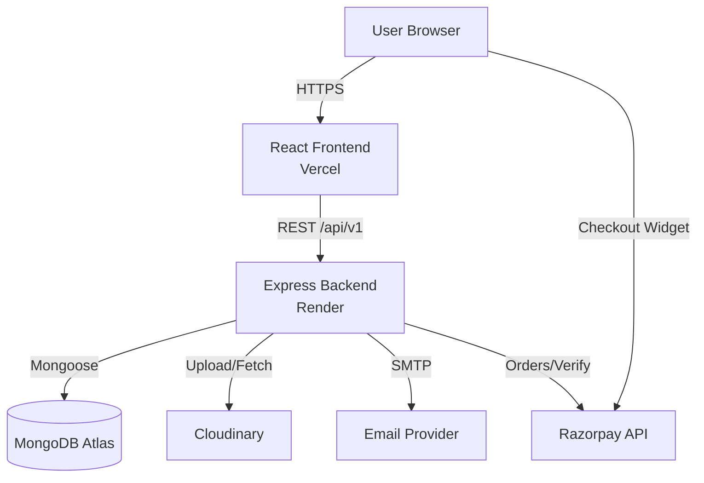
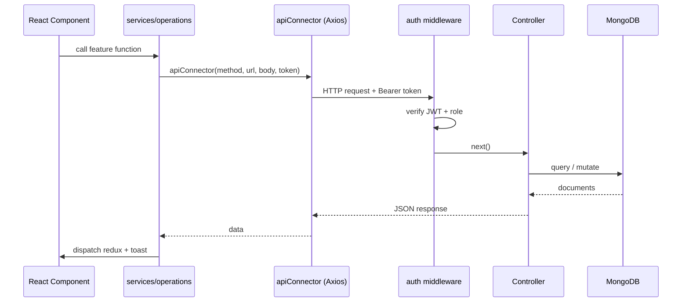
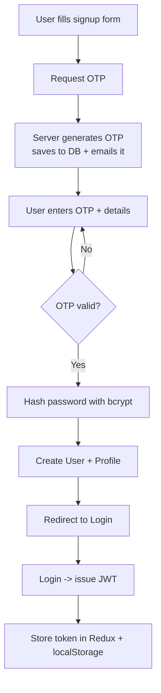
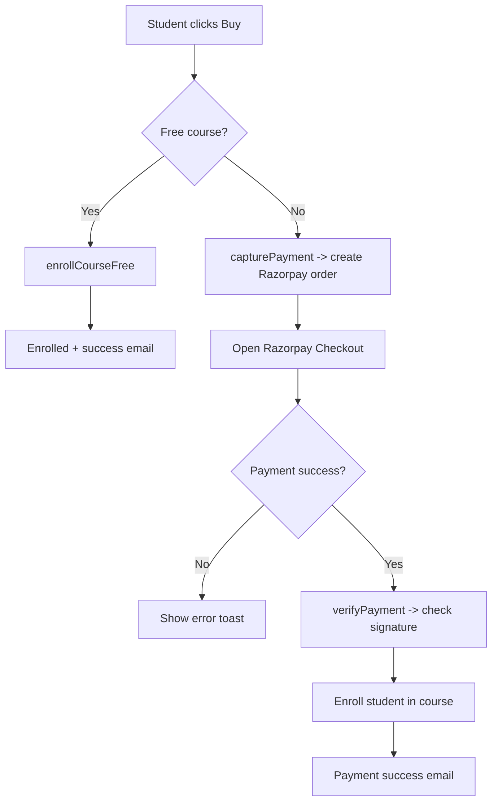
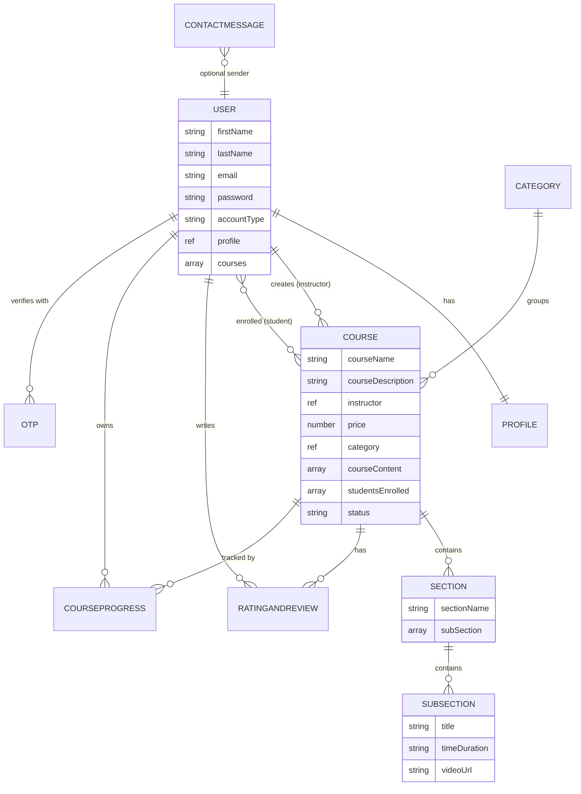
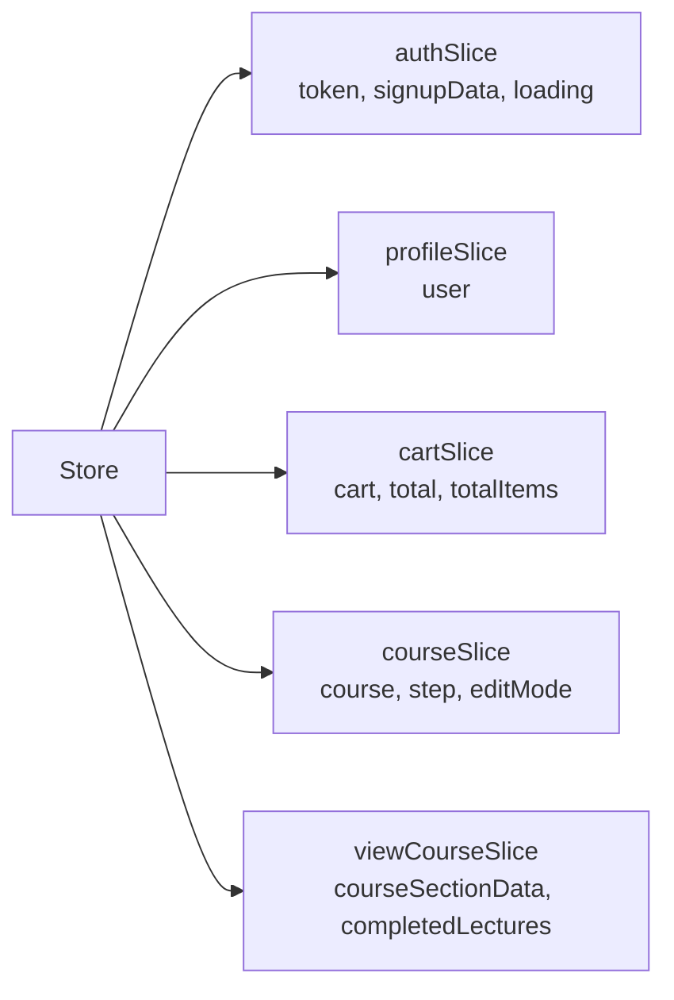
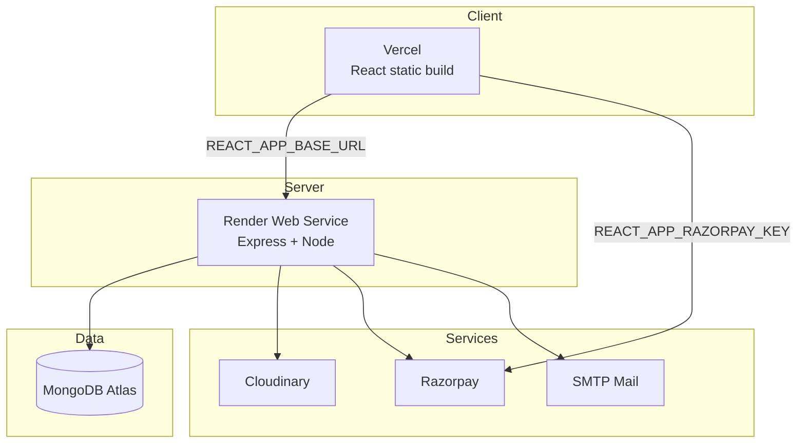
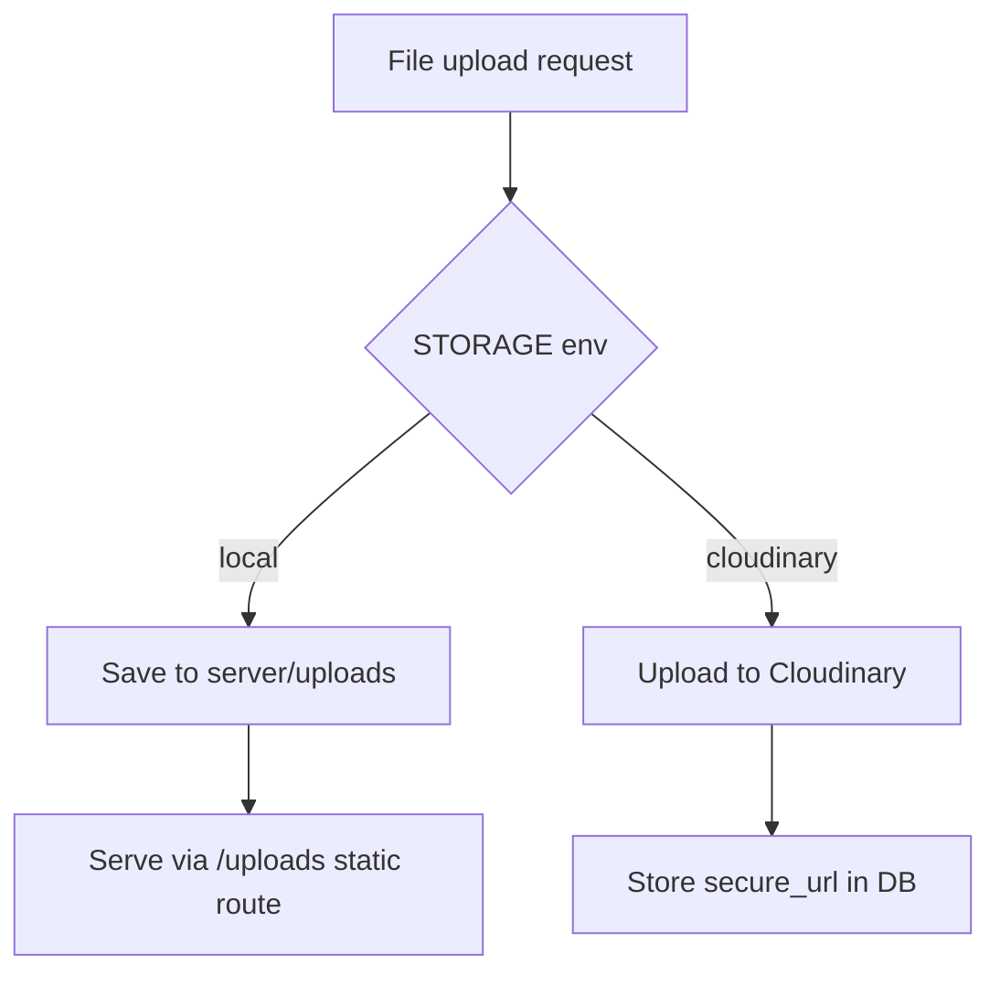

# Learnity — Diagrams

Visual references for the system. Diagrams use **Mermaid** (renders on GitHub and in VS Code with a Mermaid extension).

---

## 1. System Context Diagram

---

## 2. Request Lifecycle (typical authenticated call)

---

## 3. Authentication / Signup Flow

---

## 4. Payment / Enrollment Flow

---

## 5. Entity Relationship Diagram

---

## 6. Frontend State (Redux) Map

---

## 7. Deployment Topology

---

## 8. Media Storage Decision

